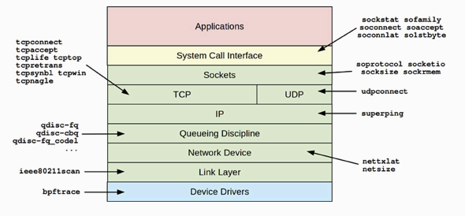

Networking
----

## BPFツール



> 出典 http://www.brendangregg.com/blog/2019-07-15/bpf-performance-tools-book.html

以下の環境で順に動かしてみた

- Ubuntu 18.04.5 LTS
- Kernel: 5.3.0-1034-aws
- bpftrace v0.11.0-131-ge525(bccともども自前でビルド)

動いてるもの

- apache2 + php-fpm7
- MySQL
- postfix
- exporter各種

Amazon Lightsail使ってる個人サーバなんですが外からのアクセスはあんまないみたいな環境です


### sockstat

High-level socket statistics
細かい分析用ではとりあえずざっくり今のネットワークの動きをみてとっかかりを得る感じのやつ

[](https://asciinema.org/a/ScD6XYirV2kbd7TjkSmttgH4A)

出力はprobe nameが生で出るのでそこからbpftraceで追加調査を行う

```
root@vietnam:~/work/bpfbook# bpftrace -e 'kprobe:sock_sendmsg { @[comm] = count(); }'
Attaching 1 probe...
^C

@[systemd-logind]: 1
@[snapd]: 1
@[pickup]: 2
@[qmgr]: 2
@[postfix_exporte]: 4
@[master]: 4
@[apache_exporter]: 8
@[process-exporte]: 8
@[systemd-journal]: 9
@[systemd-resolve]: 10
@[mackerel-agent]: 10
@[showq]: 12
@[systemd]: 13
@[node_exporter]: 16
@[apache2]: 16
@[php-fpm_exporte]: 20
@[dbus-daemon]: 31
@[mysqld_exporter]: 80
@[php-fpm7.2]: 105
@[sshd]: 112
@[mysqld]: 144
```

### sofamily

新規のソケット接続（accept(2)、connect(2)）のてトレース、サマライズを行う。

ワークロードの特徴づけや予期せぬソケット使用の確認など。

トレース対象のコールはパケットイベントに比べて想定的に少ないためオーバーヘッダは無視できると期待される。

[](https://asciinema.org/a/usVfmCRsyMtilSMY0EULTzPrY)

### soprotocol

sofamilyのprotocol版ぽいやつ


[](https://asciinema.org/a/6KwPxdFy9hmEzCzAHHqGTrnPT)


### soconnect

IPプロトコルのソケット接続リクエストを出力する。
connect(2) syscallを計測している。
syscallはプロセスコンテキストで発生するため、どのプロセスがsyscallを発行したか信頼出来るメリットがある。
latencyはconnect syscallによるもののみを計測しているため、SOCK_NONBLOCKの場合は実際のコネクションレイテンシより早く計測される。
実際のレイテンシを計測したい場合は後述のsoconnlatなどを使う。


[](https://asciinema.org/a/CbukTD9S9XlGU2QwopX05XFdX)


### soaccept

soconnectと同じようにaccept(2) syscallトレースポイントを使用したトレーシングツール。


[](https://asciinema.org/a/zt35O9ImtZPiAz6UTXwbqsXIp)


### socketio

- socketのio countを計測する
- sock_recvmsg() and sock_sendmsg() kernel functionを利用している

https://asciinema.org/a/tYO0ka5mFYIYd30WPIeAJqfCv

### socksize

IOカウントとtotal bytesをヒストグラムで表示する

[](https://asciinema.org/a/mCUhAUwOl7VGKDS6Dhr2bfn9j)

https://gist.github.com/egmc/2b2ffe6894a09c1884a065e34a5d79c6

### sormem

TCPソケットバッファを最適化するのに使うためと思われる
tcp_rmemのlimitとアロケーションをヒストグラムで表示する

[](https://asciinema.org/a/DFMJS2DvpOZzeeFule0qeQbjY)

https://access.redhat.com/ja/solutions/504383

### soconnlat

ソケット接続のレイテンシをヒストグラムとユーザーレベルのスタックトレースを添えて表示する。
コネクションの発生元をコードパスレベルで追うのに役立つ。

[](https://asciinema.org/a/40nElkJLDt57lddsNH1uxSstE)

https://gist.github.com/egmc/3d3f75a96be4dbcbf859a5cd9671ae2d


### so1stbyte

remote hostが応答するまでを計測する

動かず

https://asciinema.org/a/ZoTF4jjdMVQDAw8ey83G8Gkgt

### tcpconnect

新規のTCPアクティブコネクションを表示する。
soconnectとは違ってsocket syscallではなくTCPレイヤーのトレースポイントを使用する。
外部への接続、頻度を測定しワークロードの特性を調べるに使用する。
socketのトレーシングと違いトレース対象のイベントはプロセスコンテキストで発生しないため、プロセスの特定はベストエフォートで行われている。

[](https://asciinema.org/a/hEL80qck4eMlmoiEbJeWD6cfg)

### tcpaccept

tcpconnetの逆で新規のTCPパッシブコネクションを表示する。
bcc版、bpftrace版、balftraceでトレースポイントを使用するバージョンがある。
`tcpaccept.bt` の方はTCP listen backlogも合わせて表示する実装になっていて、Shopifyのproduction環境でピーク時にRedisでデグレが発生し、listen dropを起こしているのを突き止めるのに使われたらしい。

[](https://asciinema.org/a/UZ8tuE9XlUImDCIRjONCaQx4a)


### tcplife

TCPセッションのライフスパンを表示する。
TCPのsocket state changeイベントをトレースし、TCP_CLOSEになった際にサマリを出力する。
これらのstate changeイベントはパケット単位のイベントより低頻度となるため、オーバーヘッドは低くなり、これによりNetflixのプロダクションサーバで継続的に動作することが出来るようになっている。

[](https://asciinema.org/a/8p0JwXmaeMg4JlxbhZqxi0AV1)


### tcptop

TCPを利用しているtop processを毎秒表示するBCCツール。
TCPのsend/receiveコードパスを利用し、BPF mapに効率的にサマライズするがこれらのイベントは高頻度になりうるため、ネットワークヘビーな環境では観測可能なレベルで計測負荷が発生する。

[](https://asciinema.org/a/g1Hhn2vUdHvJIaKd8xOtH85vv)


### tcpsnoop

パケット単位のイベントをUID、PIDつきで表示するSolalisのDTraceツール。
Linux BPFにはポートされていないが、ツールが複雑になり、カーネルのアップデートに追随するのが難しくなった経緯が紹介されている・・。

### tcpretrans

TCPの再送イベントを表示する。
高頻度にSTATEがESTABLISHEDが示される場合外部ネットワークに問題が発生している傾向があり、SYN_SENTであればサーバ側でSYN backlogを消化しきれていないことを示すことになる。
カーネルのTCP retransmit eventsをトレースするので従来のパケットキャプチャに比べて無視できるほどのオーバーヘッドで動作する。

Netflixのプロダクションで外部のネットワーク限界を超過することによりパケットのドロップと再送が行われている問題を突き止めるのに使用されている。

Shopifyでもプロダクトダクションのネットワーク関連の問題をデバッグするために使われた。
（なおfirewallの設定問題だった）


[](https://asciinema.org/a/Kxhh6QvQt2wnEzBjgQVObcSxg)

http://www.brendangregg.com/blog/2018-03-22/tcp-tracepoints.html


### tcpsynbl

syn backlogのサイズと実際の使用状況をヒストグラムで表示する。
somaxconn、各ミドルウェアのbacklog値のチューニングにベンリ。
超過が発生した場合はSYNがdropされたことが表示される。

[](https://asciinema.org/a/0RGW8Ns9mXptO4mrdoRq1P3vZ)


### tcpwin

tcpのウィンドウサイズとその他のカーネルパラメータをトレースする。
そのまま使うというよりCSVを出力して統計情報を得るためのツール。

[](https://asciinema.org/a/v3VqsDaTGqqCGxEAXSoaKOLFK)


### tcpnagle

Nagleアルゴリズムによるバッファリングの発生を観測する

[](https://asciinema.org/a/QXrTOpMxMrlL0IDGhFC8Q8oW9)

### udpconnect

connect(2)を使用した新規のUDPコネクションを表示する

[](https://asciinema.org/a/QHxnsk1qzT2N8xKkJTGnW9JEe)


### gethostlatency

getaddrinfo(3)、gethostbyname(3)を通して行われた名前解決のレイテンシをトレースする。
uprobeによりライブラリコールの開始、終了を計測している。
bpftraceバージョンはShopifyのKubernetesクラスタでクラウド環境におけるホストごとのUDPセッションのlimitによる問題を見つけるのに使用された。

[](https://asciinema.org/a/Q9A66MaTW2k6ohXWwIa5E9TH0)


### ipecn

explicit congestion notification (ECN) eventsをトレースする。
PoC的な扱い。
動かんかった。

```
# ./ipecn.bt
./ipecn.bt:29:38-39: ERROR: The + operator can not be used on expressions of types pointer, integer
    $iph = (struct iphdr *)($skb->head + $skb->network_header);
```


https://www.janog.gr.jp/meeting/lt-night-1/download_file/view/16/1


### superping

ping(8)の古いバージョンはユーザースペースで動作しCPUのスケジューリングレイテンシが含まれていた。
superpingはカーネルのネットワークスタック上でレイテンシを計測する。
動作せず。

```
g# ./superping.bt
./superping.bt:34:38-39: ERROR: The + operator can not be used on expressions of types pointer, integer
    $iph = (struct iphdr *)($skb->head + $skb->network_header);
                                        ~
./superping.bt:37:43-44: ERROR: The + operator can not be used on expressions of types pointer, integer
        $icmph = (struct icmphdr *)($skb->head +

./superping.bt:51:42-43: ERROR: The + operator can not be used on expressions of types pointer, integer
    $icmph = (struct icmphdr *)($skb->head + $skb->transport_header);
                                            ~
./superping.bt:73:41-42: ERROR: The + operator can not be used on expressions of types pointer, integer
    $ip6h = (struct ipv6hdr *)($skb->head + $skb->network_header);
                                           ~
./superping.bt:76:45-46: ERROR: The + operator can not be used on expressions of types pointer, integer
        $icmp6h = (struct icmp6hdr *)($skb->head +

./superping.bt:90:44-45: ERROR: The + operator can not be used on expressions of types pointer, integer
    $icmp6h = (struct icmp6hdr *)($skb->head + $skb->transport_header);
```


### qdisc-fq

その他のqdisc関連ツール

```
qdisc-cbq.bt       qdisc-cbs.bt       qdisc-codel.bt     qdisc-fq.bt        qdisc-fq_codel.bt  qdisc-red.bt       qdisc-tbf.bt
```

設定されているQueueing Disciplineに対してキューに滞在した時間をヒストグラムで表示する。
tcで設定する必要があるので時間があればトライ・・。


### netsize

nicレイヤーにおけるパケットサイズとカーネルのネットワークスタック上におけるサイズをヒストグラムで表示し、パケット分割処理のオフロードを観測できる。
GSO、GROなど。

```
# ip l show dev eth0
2: eth0: <BROADCAST,MULTICAST,UP,LOWER_UP> mtu 9001 qdisc fq_codel state UP mode DEFAULT group default qlen 1000
    link/ether 06:70:a0:dd:97:ec brd ff:ff:ff:ff:ff:ff
```

[](https://asciinema.org/a/ZG2fDnTAMsx8bvPJVmoTEKKwQ)

https://gist.github.com/egmc/6fa92855ae0ef289ea02c2b588d7c63b


### nettxlat

NICへのエンキューからパケットが送出されるまでに時間を計測する

[](https://asciinema.org/a/dAAkHWHk6Nydwzey5gAtT3U62)

### skbdrop

unusualなskb dropイベントをトレースし、あわせてカーネルのスタックトレースを表示する。
トレーシング中のTCP関連の統計情報をnstatで取得して表示している（関連をみるため

[](https://asciinema.org/a/cVgKU8vDBSk7N4X1Oe5OGYGp7)


### skblife

パケットがカーネルのネットワークスタックで処理されていた時間を表示する。
カーネルのslab cache allocationを観測することで動作する。
オーバーヘッドが大きいので短期間の分析に利用する。

https://gist.github.com/egmc/4ffb31fef56aa386fd84f79092fbda40

[](https://asciinema.org/a/LXjbUonRty6ciEnola6yUFKQQ)

### ieee80211scan

これはWiFi scanなので当然動作せず

### Other Tools

tcpstates

[](https://asciinema.org/a/vfikFn2Am1lTdH7VKTUhgNZLq)
